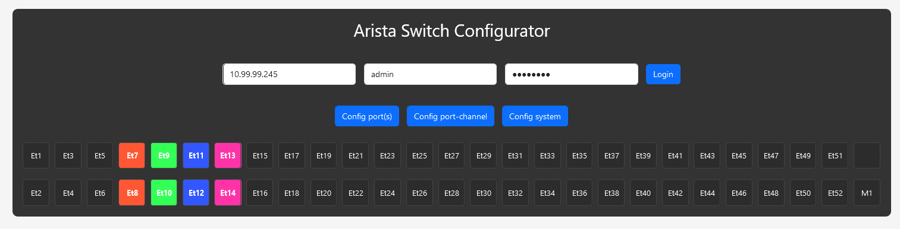

# Arista Switch Web UI

This project is a web-based user interface designed to easily configure and manage Arista switches. The Web UI provides network administrators with a clear, intuitive interface to interact with their network devices.

## DISCLAIMER !
This project is a work in progress that I’m developing in my spare time. I’m not a professional developer, so please keep that in mind!

## 📝 About
The Arista Switch Web UI allows for easy management of switch ports, VLAN configurations, port channels, and system settings through a user-friendly interface. The tool is designed to enhance productivity by simplifying network configuration tasks.

## 🚀 Features
- **Port Configuration**: Update port status, set descriptions, assign VLANs, and configure trunk/access modes.
- **Management Interface**: Configure management ports with IP and DHCP settings.
- **Port-Channel Configuration**: Configure port-channel port.
- **Multi-Port Selection**: Select multiple ports using `SHIFT + LEFT CLICK` for batch configuration.
- **Authentication**: Simple login system to connect to your Arista switch.

## 📸 Screenshots

### 1. General Overview


The main interface allows users to log in to the switch and access various configuration options.

### 2. Update Port Configuration


Easily update individual port settings like status, type (trunk/access), and VLAN assignment.

### 3. Multi-Port Selection


Select multiple ports using `SHIFT + LEFT CLICK` for bulk configuration.

### 4. Management Interface Configuration


Configure management interfaces with options like DHCP, IP address, and subnet mask.

## ⚙️ Prerequisites
Before you begin, ensure you have the following installed:
- Node.js (v14 or higher)
- npm (v6 or higher)
- An Arista switch accessible via the network

## 🛠️ Installation

1. Clone the repository:
   ```bash
   git clone https://github.com/yourusername/arista-switch-webui.git
   cd arista-switch-webui
   
## 📝Licence
Please open the file "LICENCE" to learn more about it.